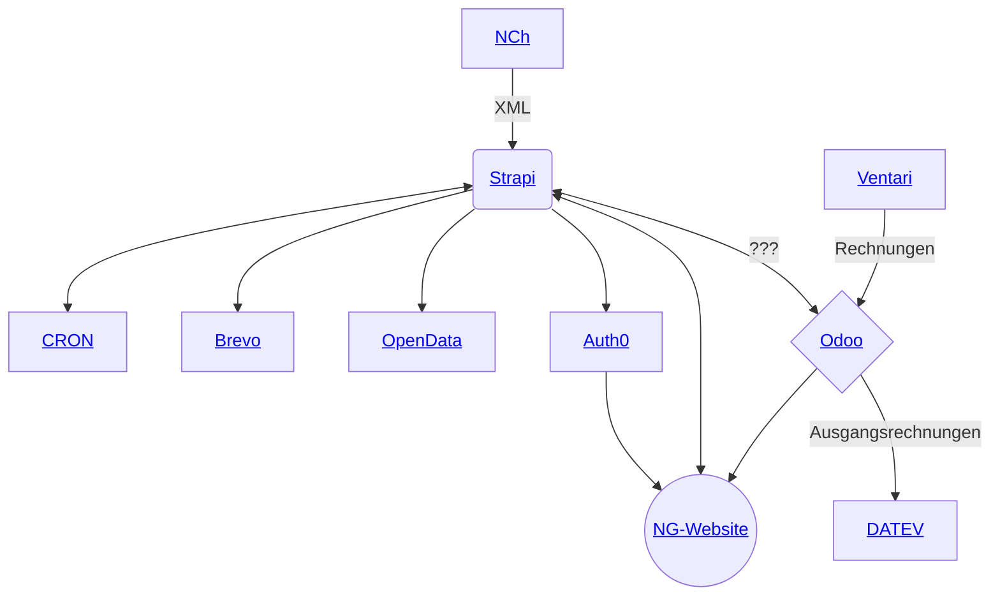

# Infrastruktur

## ⚪️ Änderungen Website

- **WebsiteNG**: neue Website der GDCh basierend auf Next.js
- **Strapi**: neues Headless CMS der GDCh

Für die Funktionalität der aktuellen Website und der App zusammen, macht bestimmte Funktionen der Open-Data-Plattform überflüssig.

## 🔷 Änderungen Odoo

- **Odoo**: ERP-System der GDCh

Odoo als ERP-System ersetzt Meta-Dok, ZAM und Sage.

## Ersetzte Komponenten

- ~~**ZAM**: zentrales Adressmanagement der Firma Lauer und Karrenbauer~~
- ~~**Meta-Dok**: Dokumentenmanagement, veraltet~~
- ~~**App**: interne Anwendung~~
- ~~**Sage**: Buchhaltungssoftware~~
- ~~**Website**: (noch) Website der GDCh~~

## Bestehende Komponenten

- **Auth0**: Authentifizierung und Autorisierung
- **Ventari**: Auftragsmanagementsoftware
- **OpenData**: OpenData-Portal der GDCh
- **NCh**: Nachrichten-aus-der-Chemie-Importer (unser Mitgliedermagazin)
- **Brevo**: E-Mail-Marketing-Tool
- **CRON**: Cron-Job (Minijobs) für die automatische Verarbeitung von Daten

[Zurück](README.md)
