# Infrastruktur

```mermaid
graph TD;
  Strapi <--> Brevo[<a href='/GDCh-de/docs/blob/main/Brevo.md'>Brevo</a>
<a href='/GDCh-de/docs/blob/main/CRON.md'>CRON</a>
<a href='/GDCh-de/docs/blob/main/Auth0.md'>Auth0</a>
...];
  Strapi(<a href='/GDCh-de/docs/blob/main/Strapi.md'>🟩 Strapi</a>) --> OpenData[<a href='/GDCh-de/docs/blob/main/OpenData.md'>OpenData</a>];
  NCh[<a href='/GDCh-de/docs/blob/main/NCh.md'>NCh</a>] --> |XML| Strapi;
  WebsiteNG((<a href='/GDCh-de/docs/blob/main/WebsiteNG.md'>⚪️ NG-Website</a>)) --> Odoo;
  Odoo{<a href='/GDCh-de/docs/blob/main/Odoo.md'>🔷 Odoo</a>} --> |Ausgangsrechnungen| DATEV[<a href='/GDCh-de/docs/blob/main/DATEV.md'>DATEV</a>];
  Strapi --> WebsiteNG;
  Odoo --> Strapi;
  Ventari[<a href='/GDCh-de/docs/blob/main/Ventari.md'>Ventari</a>] --> |Rechnungen| Odoo;
```

## ⚪️ Änderungen Website

- **WebsiteNG**: neue Website der GDCh basierend auf Next.js

Für die Funktionalität der aktuellen Website und der App zusammen, macht bestimmte Funktionen der Open-Data-Plattform überflüssig.

## 🔷 Änderungen Odoo

- **Odoo**: ERP-System der GDCh

Odoo als ERP-System ersetzt Meta-Dok, ZAM und Sage.

## 🟩 Änderungen Strapi

- **Strapi**: neues Headless CMS der GDCh

Strapi ersetzt Hygraph.

## Ersetzte Komponenten

- ~~**ZAM**: zentrales Adressmanagement der Firma Lauer und Karrenbauer~~
- ~~**Meta-Dok**: Dokumentenmanagement, veraltet~~
- ~~**App**: interne Anwendung~~
- ~~**Sage**: Buchhaltungssoftware~~
- ~~**Website**: (noch) Website der GDCh~~
- ~~**Hygraph**: Headless CMS~~

## Bestehende Komponenten

- **Auth0**: Authentifizierung und Autorisierung
- **Ventari**: Auftragsmanagementsoftware
- **OpenData**: OpenData-Portal der GDCh
- **NCh**: Nachrichten-aus-der-Chemie-Importer (unser Mitgliedermagazin)
- **Brevo**: E-Mail-Marketing-Tool
- **CRON**: Cron-Job (Minijobs) für die automatische Verarbeitung von Daten

[Zurück](README.md)
