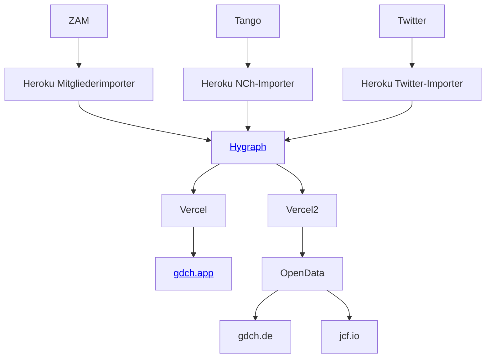

# Infrastruktur

```mermaid
graph TD;
  Hygraph[<a href='/GDCh-de/docs/blob/main/hygraph.md'>Hygraph</a>] --> Vercel --> App[<a href='https://gdch.app'>gdch.app</a>];
  ZAM --> Heroku1[Heroku Mitgliederimporter] --> Hygraph;
  Tango --> Heroku2[Heroku NCh-Importer] --> Hygraph;
  Twitter --> Heroku3[Heroku Twitter-Importer] --> Hygraph;
  Hygraph --> Vercel2 --> OpenData --> gdch.de;
  OpenData --> jcf.io
```

## Überschrift

Erklärung

[Zurück](README.md)
