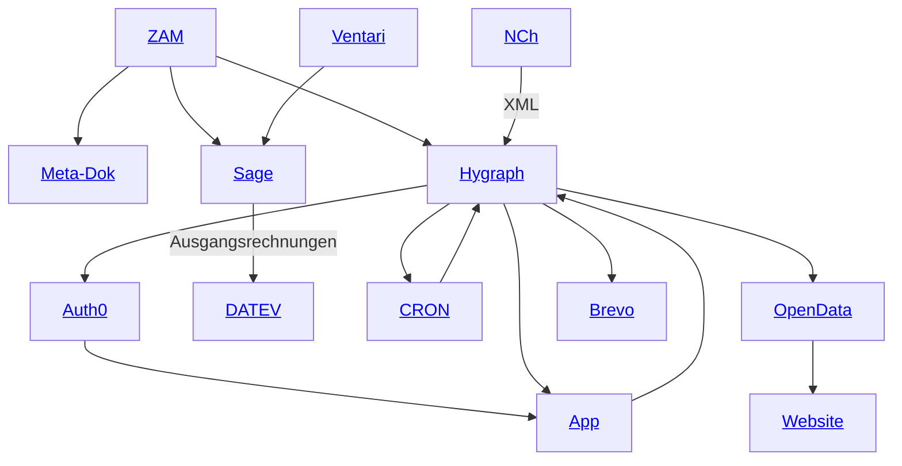

# Infrastruktur

## Erklärungen

- **ZAM**: zentrales Adressmanagement der Firma Lauer und Karrenbauer
- **Meta-Dok**: Dokumentenmanagement, veraltet
- **Auth0**: Authentifizierung und Autorisierung
- **App**: interne Anwendung
- **Sage**: Buchhaltungssoftware
- **Ventari**: Auftragsmanagementsoftware
- **OpenData**: OpenData-Portal der GDCh
- **NCh**: Nachrichten-aus-der-Chemie-Importer (unser Mitgliedermagazin)
- **Brevo**: E-Mail-Marketing-Tool
- **CRON**: Cron-Job (Minijobs) für die automatische Verarbeitung von Daten
- **Website**: (noch) Website der GDCh

[Zurück](README.md)
